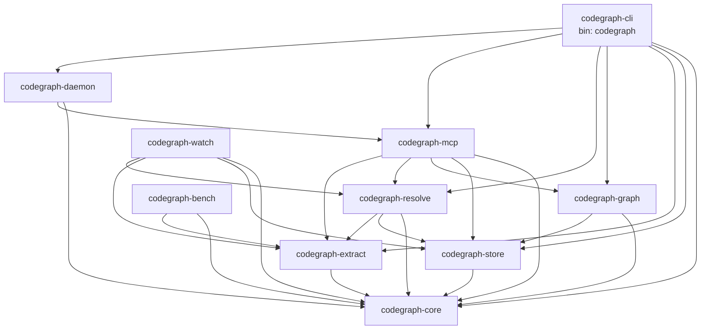
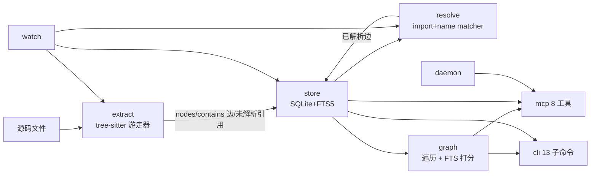

# CodeGraph (Rust) 架构 / Architecture

本文档描述 Rust 移植版 CodeGraph 的 AS-BUILT 架构：10 个 crate 的依赖关系与职责、
提取 → 落库 → 解析 → 接口的流水线、图遍历与检索的语义、MCP/CLI 表面，以及
daemon/watch 生命周期。

所有断言均对照已提交的代码核对。性能数字不在本文范围。

---

## 1. Crate 依赖图 / Crate Dependency Graph

工作区为 10 个 crate：8 个库、1 个二进制（`codegraph`，由 `codegraph-cli` 经
`[[bin]]` 产出）、1 个库/二进制混合（`codegraph-bench`）。下图只画**工作区内部**
依赖（不含 serde/rusqlite/tree-sitter 等第三方依赖）。

依赖关系直接来自各 crate 的 `Cargo.toml`（`grep '^codegraph-'`）。要点：

- `codegraph-core` 是叶子，被所有人依赖，自身**零**工作区内部依赖。
- `codegraph-extract` 只依赖 `core`：提取层不感知存储或图。
- `codegraph-graph`（遍历 + 检索）依赖 `store`，不依赖 `extract`。
- `codegraph-resolve` 依赖 `extract`（用其公共 `extract_file`/`detect_language`）、
  `store`（读节点/边、写解析边）与 `core`。
- `codegraph-mcp` 聚合 `store`/`graph`/`resolve`/`extract`，是查询侧的汇聚点。
- `codegraph-daemon` 依赖 `mcp`（守护进程 socket 后面跑 MCP 会话）。
- `codegraph-cli` 依赖除 `watch`/`bench` 外的全部产品 crate，并组装索引流水线。
- `codegraph-bench` 仅依赖 `core` + `extract`（用于 Rust 端 parse-only 子指标 +
  等价预言机），不修改任何产品 crate。

> 注：`codegraph-cli` 当前未直接依赖 `codegraph-watch`（`sync` 复用全量索引路径，
> 见 §7）。`watch` crate 的公共 API 已就绪，供后续接线。

---

## 2. 分层概览 / Layering Overview

数据从左向右流动：提取产生事实，落库持久化，解析补全跨文件边，图/检索在持久化
数据上回答查询，MCP/CLI 是两个对外表面。daemon 负责进程生命周期，watch 负责
变更驱动的增量重建。

---

## 3. 提取流水线 / Extraction Pipeline（`codegraph-extract`）

入口：`extract_source(file_path, source, language)` 与 `extract_file` /
`scan_project`（`engine.rs`）。语言识别由 `detect_language()`（按扩展名 + 嵌入式
检测）完成。

分派顺序（自定义路径优先于文法路径）：

1. **嵌入式 / 自定义** — `embedded::extract_embedded(...)` 处理 `.vue`/`.svelte`/
   `.razor`/`.cshtml`/`.liquid`/Shopify JSON/`.xml`(MyBatis)/`.dfm`/`.fmx`。
2. **文件级（file-level-only）** — `yaml`/`twig`/`properties` 返回空结果
   （0 节点、0 边、**无**文件节点）。
3. **tree-sitter 文法** — `spec_for_language()` 返回某语言的 `LanguageSpec`
   （TypeScript/Python/Go/Rust/Java/C/C++/C#/PHP/Ruby/Scala/Lua/Luau/Dart/Kotlin/
   Swift/Pascal/ObjC 及 TSX/JSX）；其余返回空（`Unknown` 静默，其他记一条
   `Unsupported language` 错误）。

文法路径内部（`walker.rs` 的 `TreeSitterWalker`）：

- `extract`：创建**文件节点**（字面量 ID `file:{relpath}`），初始化节点栈，
  组装 `ExtractionResult`。
- `visit_node`：按节点类型分派到 `extract_function`/`extract_class`/
  `extract_method`/`extract_enum`/`extract_interface`/`extract_import`/
  `extract_call`/`extract_instantiation` 等，并控制是否跳过子树。
- `create_node`：生成节点 ID（非文件节点走
  `generate_node_id(file, kind, name, start_line)`，1-based 行号），从语义栈
  （排除文件节点）构造 `qualified_name`，并即时发出 `contains` 边。

**关键边界：** 提取层把**结构性边**（`contains`）与**未解析引用**
（calls/imports/instantiates/decorates）分离——`contains` 立即发出，其余作为
`unresolved_references` 留给解析层。提取层不感知 `store`/`graph`。

`LanguageSpec`（`spec.rs`）定义每种语言的节点类型
映射 + body/name/signature/export/static/async/import/modifiers 钩子，便于把
各语言规则机械地落到 `lang/<language>.rs`。

`scan_project` 对路径排序后解析，rayon 仅并行**独立文件**的解析；输出按排序顺序
合并，保证确定性（sequential 与 parallel 结果逐字节相等）。

---

## 4. 落库层 / Store Layer（`codegraph-store`）

`Store::open` 执行有效初始化：打开/创建 SQLite → 应用连接 PRAGMA →
执行 `schema.sql` → 记录 schema 版本 5（`Initial schema includes all migrations`，
避免在全新库上重放 v2–v5）→ 运行 `ANALYZE`（使 `.schema` 含 `sqlite_stat1`）。

- 连接 PRAGMA、6 张应用表、FTS5 虚表 `nodes_fts`（external-content）、3 个触发器
  （`nodes_ai`/`nodes_ad`/`nodes_au`）、迁移序列等存储契约的权威定义见
  [`data-model.md`](data-model.md)。
- CRUD/查询表面对应 `db/queries.ts` 的查询集：`upsert_nodes`（用
  `ON CONFLICT(id) DO UPDATE` 以正确触发 FTS 更新，而非 `INSERT OR REPLACE`）、
  `insert_edges`（`INSERT OR IGNORE` + 端点预检）、按 name/qualified_name/file_path/
  kind/lower(name) 的读取，以及 `search_nodes_fts*`、`nodes_by_ids`、
  `node_counts_by_kind` 等供上层使用。
- 跨语言读取健壮性：`files.modified_at` 在真实数据库中为 SQLite REAL
  （JS `Date.now()`），故 `millis_column` 把 INTEGER|REAL|NULL 统一为 i64。

---

## 5. 解析层 / Resolution Layer（`codegraph-resolve`）

把提取阶段留下的 `unresolved_references` 解析为跨文件的边
（`src/resolution/` 的解析逻辑）。

- **import resolver**（`import_resolver.rs`）：`extract_import_mappings`（JS/TS/
  Svelte/Vue/Python/Go/Java/Kotlin/PHP/C/C++）、`resolve_via_import`、
  `resolve_jvm_import`、`extract_re_exports` + `find_exported_symbol`（re-export
  追链，深度上限 8）。路径运算（resolve/relative/dirname/...）在 `pathutil.rs` 中
  **纯词法**实现（不碰真实文件系统，是否存在交给 `ResolutionContext::file_exists`）。
- **name matcher**（`name_matcher.rs`）：`match_reference` 按策略序 0/1/1c/1d/2/3/4
  匹配——文件路径、qualified-name、作用域链（PHP/Rust）、点号链（Java/Kotlin/C#/
  Swift/Go/Scala/Dart）、方法调用、精确名、模糊匹配。
- **orchestrator**（`resolver.rs`）：`ReferenceResolver` 提供 `resolve_all` /
  `resolve_one` / `create_edges` / `resolve_and_persist`，含内建/外部过滤集合与
  语言/框架门控。解析对 `&Store` 同步只读（`StoreResolutionContext`），解析后经
  独立 `&mut Store` 持久化边，缓存用 `RefCell<Caches>` 内部可变。

**`FrameworkResolver` 扩展点（关键约束）：** 这是一个**仅 trait** 的扩展点
（`framework.rs`），v1 **零具体实现**。orchestrator 持有空的
`Vec<Box<dyn FrameworkResolver>>`，因此行为等同于“零框架检测”下的结果。
框架感知解析、回调合成、C++/Java 接收者推断、批处理/conformance 二次扫描等均为
延后项（内部上游差异台账登记）。

mini golden 校验：提取 → 落库 → `resolve_and_persist` 后回读非 `contains` 边，
其集合与 `reference/golden/mini/edges.json` 的 11 条已解析边**逐项相等**
（kind/source/target/line/col/resolvedBy/confidence）。

---

## 6. 图遍历与检索 / Graph Traversal & Search（`codegraph-graph`）

该 crate 含两个隔离的子模块：`graph/`（遍历）与 `query/`（检索）。
`GraphTraverser<'store>` 对 `&Store` 同步只读。

**遍历（`graph/mod.rs`，对应 `graph/traversal.ts` 的遍历语义）：**

- `get_callers` / `get_callees`：**仅**沿 `calls`/`references`/`imports` 三类边，
  递归到 `max_depth`，`visited` 防环。`callees` **不**含 `instantiates`。
- `get_impact_radius`：沿**入边**（依赖者）但**排除** `contains`（容器不依赖其成员）；
  容器类节点（class/interface/struct/trait/protocol/module/enum）在**同深度**把
  `contains` 子节点拉入集合，再在 depth+1 递归这些子节点的依赖者。
- 另有 `traverse_bfs`/`traverse_dfs`（BFS 前沿排序 `contains`(0) < `calls`(1) <
  其他(2)）、`get_type_hierarchy`、`get_call_graph`、`find_usages`、`find_path`、
  `get_ancestors`（沿首条入向 `contains` 上溯）、`get_children`、
  `find_all_definitions`（枚举同名重载，文件/行消歧留给 MCP 层）。

**检索（`query/mod.rs`，对应 `searchNodes`（queries.ts:775-892）的检索管线）：**
`parseQuery`（拆出 `kind:`/`lang:`/`path:`/`name:` 过滤）→ 与选项合并去重 →
FTS5 候选（`search_nodes_fts_filtered`）→（空且文本≥2）LIKE 阶梯 →（空且文本≥3）
有界编辑距离模糊 → 精确名补充 → 重打分（`kindBonus` + `scorePathRelevance` +
`nameMatchBonus`）→ 硬 `path:`/`name:` 过滤。FTS5 转义与 store 的 `fts_query`
一致（`::`→空格、剥离 `'"*():^`、丢弃 AND/OR/NOT/NEAR、每词 `"term"*` 以 OR 连接）。
`reference/golden/mini/search.golden.json` 的 20 个用例（id + 顺序 + score 在 1e-6
内）全部复现。

---

## 7. CLI 表面 / CLI Surface（`codegraph-cli`）

`codegraph` 单一二进制，clap 13 个子命令（见
[README §CLI 子命令](../README.md#cli-子命令--cli-subcommands共-13-个)）。CLI 负责
rust-base-convention bootstrap：解析命令取项目根 → `init_config` fail-fast（人类可读
错误）→ `init_logger`（在 `main` 中持有 guard；CLI 进程关闭 stdout/file 输出，
保证 JSON 输出干净）。

- 索引编排只用各 crate 公共 API：`extract::engine::{scan_project, extract_file}` →
  `store::Store` upsert/insert → `resolve::ReferenceResolver::resolve_and_persist`。
  全量索引写 `.codegraph/codegraph.db`、文件记录、结构边、未解析引用、已解析边及
  索引元数据。
- `serve --mcp` 调用 `codegraph_mcp::McpServer` 公共入口（stdin/stdout）。
- **`sync` 当前复用安全的全量索引路径**（`main.rs` 注释标明），即“增量”实为全量
  重建——这是 daemon/watch 接线前的有意取舍，已在基准报告中如实记录。

子命令的输出/JSON 形状遵循固定的输出/JSON 契约（源码注释标注行号）。

---

## 8. MCP 表面 / MCP Surface（`codegraph-mcp`）

stdio JSON-RPC 服务器，**换行分隔分帧**（非 LSP `Content-Length`）。

- crate 布局：`protocol.rs`（JSON-RPC 线类型 + `ToolResult`）、`instructions.rs`
  （`SERVER_INSTRUCTIONS` 原样）、`schemas.rs`（内嵌 `tools_list.json` 保证 schema
  parity，并含“恰好 8 工具、无 trace/context”的守护测试）、`engine.rs`（8 个同步
  处理器 + 渲染器）、`server.rs`（同步 stdio 循环 + 按项目的 engine 缓存）。
- 协议：`initialize` 返回 `{protocolVersion:"2024-11-05", capabilities:{tools:{}},
serverInfo:{name:"codegraph",version}, instructions}`；`tools/list` 返回 8 工具；
  `tools/call` 返回 `ToolResult`；并回应 `ping`/`resources/list`/
  `resources/templates/list`/`prompts/list` 以抑制探针噪声；未知方法 `-32601`，
  不可解析行 `-32700`（保持存活）。
- **双错误通道：** 未知**工具名** → JSON-RPC 错误 `-32602`（派发前校验）；缺失/非法
  **必填参数** → 工具结果 `{content, isError:true}`，文本 `Error: <msg>`。
- 8 工具：`codegraph_search`/`callers`/`callees`/`impact`/`node`/`explore`/`status`/
  `files`（语义见 README）。`node` 兼具符号视图与文件视图（带 `<n>\t<line>` 行号
  源码）；`explore` 输出 blast-radius + 关系图（小项目门控关闭）+ 源码块
  结构（RWR/个性化 PageRank 排序为已登记差异，见 `KNOWN_DIFFS.md`）。同步逻辑，
  不引入 tokio。

逻辑层（遍历/检索/解析）全部委派给 `graph`/`resolve`/`store`，MCP 只做协议、参数
校验与输出渲染（多数工具对 mini golden 字节一致）。

---

## 9. Daemon / Watch 生命周期

**`codegraph-daemon`（按项目单实例）：**

- 入口 `start_or_attach(project_root, DaemonOptions)`：首个调用者启动守护进程，
  后续调用者 attach 到既有 socket；另有 `run_foreground`/`attach_to_daemon`/
  `unlock_project`/`daemon_pid_path`/`daemon_socket_path`。
- 会合文件位于 `<project>/.codegraph/`：`daemon.pid` 与 `daemon.sock`（socket 路径
  过长时回落到哈希后的 tmpdir socket）。
- 加锁逻辑（`daemon.ts:393-412`）：完整 JSON 锁信息先写私有临时文件，再原子
  hard-link 就位，避免空/半写 pidfile 竞争。
- 陈旧解锁镜像 `daemon.ts:453-481`：删除前重读、已知 pid 时比对、**绝不**清除存活
  pid。看门狗镜像 `ppid-watchdog.ts:48-61`：ppid 偏离或宿主 pid 存活判定触发停机。
- 每个连接一个会话（hello 行 + 独立会话计时），MCP 会话经 `codegraph_mcp::McpServer`
  在 socket 后服务。`codegraph unlock` 也尝试通过 `unlock_project` 回收陈旧
  pidfile。

**`codegraph-watch`（去抖动 + 增量同步）：**

- 公共 API：`start_serve_watcher`、`ProjectWatcher`、`WatchOptions`、
  `sync_changed_paths`、`sync_project_once`、git hook 助手等。
- 基于 `notify` v6 `RecommendedWatcher`（递归 + 测试用 inert seam）。事件循环按
  burst 合并：每事件重置单一去抖截止点（`watcher.ts:529-540`）。
- 默认去抖 `CODEGRAPH_WATCH_DEBOUNCE_MS`，clamp 到 100ms..60s，回落 2000ms。
- 过滤逻辑：默认忽略目录 + 根 `.gitignore` 合并（negation 在内建之后应用）。
- 增量同步：对候选变更文件读取并哈希，`files.content_hash` 命中则跳过；否则删除
  旧的 per-file 节点/文件行 → 写入新提取结果 → 持久化后跑 `ReferenceResolver`。
  `codegraph-extract` 保持只读，watch 仅调用其公共 API。

---

## 10. 基准 / Benchmark（`codegraph-bench`）

`bench` 二进制（`--run`/`--corpora`/`--out`/`--report-md`/`--render-md`）执行
跨实现的全量/查询性能对比，并内含等价预言机库
（`oracle::canonicalize_db`/`assert_equivalent`）。只依赖 `core` + `extract`
（用于 Rust 端 parse-only 子指标），**不**修改产品 crate。

等价保证的层级定义见 [`equivalence.md`](equivalence.md)。
