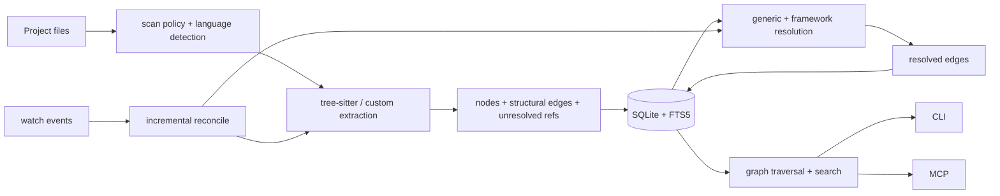

# CodeGraph architecture

This page describes the current Rust implementation. It covers ownership and
data flow; detailed CLI, MCP, storage, and golden contracts live in their owning
references.

## Workspace graph

The root `Cargo.toml` workspace list and each crate manifest are authoritative.
The following diagram shows normal (shipped) intra-workspace dependencies; test
and benchmark-only development dependencies are omitted.

```mermaid
graph TD
    core[codegraph-core]
    extract[codegraph-extract]
    store[codegraph-store]
    resolve[codegraph-resolve]
    graph[codegraph-graph]
    mcp[codegraph-mcp]
    watch[codegraph-watch]
    daemon[codegraph-daemon]
    ui[codegraph-ui]
    cli[codegraph-rs / codegraph binary]
    bench[codegraph-bench]

    extract --> core
    store --> core
    resolve --> core
    resolve --> extract
    resolve --> store
    graph --> core
    graph --> store
    mcp --> core
    mcp --> graph
    mcp --> resolve
    mcp --> store
    watch --> core
    watch --> extract
    watch --> resolve
    watch --> store
    daemon --> core
    daemon --> mcp
    daemon --> watch
    ui --> core
    ui --> extract
    ui --> store
    ui --> resolve
    ui --> graph
    ui --> mcp
    ui --> watch
    cli --> core
    cli --> extract
    cli --> store
    cli --> resolve
    cli --> graph
    cli --> mcp
    cli --> watch
    cli --> daemon
    cli --> ui
    bench --> core
    bench --> extract
```

| Crate               | Responsibility                                                        |
| ------------------- | --------------------------------------------------------------------- |
| `codegraph-core`    | shared types, node IDs, configuration, classification, logging        |
| `codegraph-extract` | source discovery, language/custom extraction, unresolved references   |
| `codegraph-store`   | SQLite/FTS5 schema, migrations, persistence, queries, leases          |
| `codegraph-resolve` | generic import/name matching and framework-aware resolution           |
| `codegraph-graph`   | traversal, impact, query parsing, search ranking                      |
| `codegraph-mcp`     | tool schemas/engine, rmcp stdio and streamable-HTTP transports        |
| `codegraph-watch`   | incremental reconciliation and filesystem watcher                     |
| `codegraph-daemon`  | detached shared process, IPC, and process registries                  |
| `codegraph-ui`      | browser viewer: loopback JSON API, live channel, embedded `ui/` build |
| `codegraph-rs`      | clap CLI, agent installer, orchestration, shipped binary              |
| `codegraph-bench`   | equivalence oracle and benchmark harness; not shipped                 |

The dependency direction keeps extraction independent of persistence and keeps
storage independent of query presentation. The CLI is the product assembly root.

## Indexing data flow

```mermaid
graph LR
    source[Project files] --> scan[scan policy + language detection]
    scan --> extract[tree-sitter / custom extraction]
    extract --> facts[nodes + structural edges + unresolved refs]
    facts --> store[(SQLite + FTS5)]
    store --> resolve[generic + framework resolution]
    resolve --> edges[resolved edges]
    edges --> store
    store --> query[graph traversal + search]
    query --> cli[CLI]
    query --> mcp[MCP]
    watcher[watch events] --> reconcile[incremental reconcile]
    reconcile --> extract
    reconcile --> resolve
```

### Discovery and extraction

`codegraph-extract` applies project configuration, ignore rules, extension
overrides, generated-file signals, and deterministic path ordering before
parallel file parsing. A file then follows one of these paths:

1. a custom/embedded extractor (Vue, Svelte, Astro, Razor, Liquid, MyBatis XML,
   DFM/FMX);
2. a grammar-backed `LanguageSpec` and generic tree-sitter walker; or
3. file-level handling for formats that intentionally expose no language symbols.

The walker emits file/symbol nodes and structural ownership edges immediately,
and so the value references of a file, which need nothing outside it (see
[`data-model.md`](data-model.md#edges)). Calls, imports, type relationships, decorators, and framework evidence that need
global knowledge are stored as unresolved references. Per-file extraction is
fail-closed: an unsafe tree depth or fatal parse condition cannot leave a partial
replacement graph for that file.

File parsing can run in parallel because each input is independent. Persistence
and later resolution restore stable order before output; scheduler completion
order is never a graph contract.

### Storage

`codegraph-store` owns a project-local SQLite database with FTS5. Fresh databases
start at the current schema; older supported databases advance through ordered,
transactional migrations. Foreign keys, WAL behavior, indexes, FTS triggers, and
lease/state gates are configured by the store rather than by callers.

See [`data-model.md`](data-model.md) for the current schema version, tables,
indexes, and migration history.

### Resolution

`ReferenceResolver` reads the complete extracted snapshot (or the bounded
streaming path for very large graphs), then applies deterministic strategies.
Every entry (the full index's batches, the serial pass, a sync's scoped pass)
resolves and persists the wiring references first, imports and `extends`/
`implements` supertypes, and the rest after them, so a call on a receiver
typed as a subclass reaches a method its base declares within one pass. A C
or C++ base is resolved only by C++ name lookup (the scopes around the
deriving class, its file's namespace aliases and `using` lines, a
translation unit's own classes), never by the strategies below:

1. language-aware imports, re-exports, packages, and paths (a CommonJS
   `require('./x')` imports its file, and a call through a `require` binding
   follows `module.exports`, `exports.name = …`, a `require(…).member` and a
   `.default` the way the module exports them; `export * as ns` exports the
   namespace alone, a namespace import's `z.core.fn()` continues into it, and
   `import { default as X }` is the default import; a Python name imported
   from a package follows the package's named and star re-exports to its
   definition, three modules deep);
2. qualified, scoped, receiver/type, lexical, and exact-name matching (a
   receiver written as, or inferred to be, a type the project does not declare
   stops the name guesses, except that a C# call still reaches the one
   project extension method in scope that takes that type as `this` and fits
   its arguments; a class-name receiver also reaches the class
   methods its declared supertypes provide; a receiver-word guess never takes
   a framework-dispatched handler, an unnamed test double or the caller
   itself; in a language that overloads by arity, a call then moves to the
   same-owner overload its argument count fits, or in Swift its argument
   labels), then a
   last-resort fuzzy match that ignores case only in PHP, Pascal and CFML,
   whose identifiers do;
3. detected `FrameworkResolver` implementations; and
4. bounded follow-up passes for relationships that require graph conformance.

The selected target then passes fail-closed correctness gates: language/module
visibility, C-family macro and translation-unit scope, Go local bindings,
external-import locality, and target-kind eligibility. A JS-family import is
from outside the repository only when the importing file's package.json, or
an enclosing one, declares the package (a `workspace:`, `file:` or `link:`
dependency is the repository's own, and a Deno import map counts), or it is a
Node built-in, `@std/…`, a runtime scheme (`node:`, `npm:`, `jsr:`) or a
framework's virtual module (`$app/…`, `astro:…`); an alias the resolver does
not follow (`$lib/…`, `~/…`) stays the project's. Calls in Vue, Svelte and
Astro components follow the JS/TS rules and, like ArkTS, see the JS
built-ins, unless the file imports its own binding of the built-in's name.
A result that lands on
the referencing node itself is kept only when nothing rules it out: a call
written through `super` / `base` / `parent::`, on another object's value, or
from a value's initializer is not a self-call, and a type never inherits from
itself (the other type of its name its written qualifier leads to is taken
instead, or none). A name match from non-test code never reaches a symbol
in a test suite (a test source set, a `tests/` / `spec/` / `e2e/` tree, a
`FooTest.kt` / `test_foo.py` / `foo.test.ts` / `foo_unittest.cc` file): test
support a project ships (`testing/`, `fakes/`, a `*-test` module) stays in
reach, and so does a C or C++ file the reference's translation unit
includes. A type name a declaration around the reference declares as a type
parameter (`class Foo<T>`, `def f[A]`, `<T> T max(`, `template <typename T>`) is
that parameter, never a project type of its name; a Scala def's value
parameter is that parameter, and a bare Scala type name reaches another
type's member only from inside it, a subtype, or a file importing its members
(otherwise the type of that name in scope is taken). A function or type
declared inside a function is reached only from inside it, and a Python name
passed as a value that its function binds (a parameter, an assignment, a
`for` / `as` target) is that local, unless a pytest fixture of its name is in
reach (its own module, or a `conftest.py` above it); a JS/TS name the calling
function binds itself (a parameter, or a `var` / `let` / `const` above the
reference) is that local, never a same-named function elsewhere in its file,
and a name destructured from a call's result (`const { login } = useAuth()`)
is the function the callee returns under that key.
A name match from another file never reaches an ES module's top-level binding
the module does not export (the `export` keyword, an `export { … }` list,
`export default x` and `export default { … }` export it; classic scripts,
CommonJS and `.d.ts` files keep their globals), nor a declaration in a Svelte
instance `<script>` or a Vue `<script setup>` (a `<script module>`, a plain
Vue `<script>` and a type a `<script setup>` exports stay importable). A name
match from another file never reaches into a minified script (`*.min.js`, `*-min.js`, a script
whose text is mostly code on lines of a thousand characters, or a webpack
build), though what an import names still binds and calls inside the script
still resolve; a sync that changes such a script re-resolves the references
naming its symbols, since its verdict can flip with no symbol moving. Pure JS-family alias
bindings may forward to a unique callable; wrappers and ambiguity stop at the
binding. A framework-resolved edge carries its own reachability proof and is not
erased by ordinary source-language visibility (for example Tauri IPC to a
private Rust command).

The registered framework candidates are NestJS, React/Next.js, Vue/Nuxt, Godot,
and Tauri, in a deliberate order. Each activates only when its detection guard
matches, and resolves only references written in its own languages (React
and Vue their scripts', NestJS TypeScript and JavaScript, Tauri the JS-family
`invoke` sites and Rust; Godot stays universal). React and NestJS detect a
dependency in any `package.json` detection reads (upstream #2395): the root's
and up to 24 nested ones, first those one or two directories down on the path
to an indexed file, then those deeper above JavaScript-family code
(`src/Web/ClientApp/`), shallowest first, never one inside `node_modules`. A
framework may name the packages its apps declare (upstream #2129); when some
manifest declares one, its extractor runs only on files whose nearest
`package.json` naming any such framework names it, so a router reads its own
app in a monorepo. No registered framework names any yet. React extracts only routes, from `.tsx`/`.jsx` files too (components and hooks are the tree-sitter extractor's, upstream #841); it leaves a name the file imports to import resolution and reaches a hook or context by name only in the file that declares it (#2120, #2240). NestJS takes a provider by its naming convention (`*Service`, `*Controller`, …) only from the reference's own file or the convention file beside it (#2246), and names each route by the path a request takes to it: its module's `RouterModule` prefix and its app's global prefix and URI version (#2117). The routes are renamed in place after extraction, keeping their ids, and a route nothing renames any more gets the name its file gives it back. Godot also extracts project/scene/resource relationships; Tauri bridges
literal JS-family `invoke` calls to uniquely registered Rust commands. Ambiguous
or dynamic targets remain unresolved rather than falling through to a global
same-name guess.

The static/runtime boundaries for supported languages and Godot are documented in
[`languages.md`](languages.md), [`godot.md`](godot.md), and the upstream-difference
ledger in [`upstream-sync/KNOWN_DIFFS.md`](upstream-sync/KNOWN_DIFFS.md).

## Query layer

`codegraph-graph` operates on persisted nodes and edges. It owns callers,
callees, impact, paths, hierarchies, cycle detection, FTS candidates, fallback
matching, filters, and deterministic scoring. Generated/ambient/deprioritized
paths can affect ranking without removing graph facts.

The CLI and MCP share the same query engine for `search`, `explore`, and `node`,
so source selection, staleness handling, and relationship rendering do not drift
between interfaces.

## CLI assembly

The `codegraph-rs` package builds the `codegraph` binary. The CLI owns:

- lifecycle commands (`init`, `sync`, full index, status, recovery);
- query and analysis commands;
- MCP process launch and HTTP/stdio observability commands;
- agent/IDE configuration and Skill installation;
- shell completion and self-update; and
- human/JSON output contracts.

The CLI directly uses `codegraph-watch` for one-shot incremental synchronization
and `codegraph-daemon` for shared MCP service. It keeps logs on stderr so JSON and
MCP stdout remain protocol-clean. The complete command contract is
[`cli.md`](cli.md).

## MCP architecture

`codegraph-mcp` uses rmcp and Tokio for MCP protocol handling over stdio and
streamable HTTP. The source schema defines a known callable tool set and a smaller
default `tools/list` surface; an allowlist can expose any known tool. The current
source-derived counts are validated by `scripts/docs-check.py`, not maintained as
an unchecked architecture constant.

Each tool call resolves its project independently. A pinned server uses its
launch project; an unpinned server can use an explicit `projectPath`, client MCP
roots, or bounded deterministic workspace adoption. Engine caches are reopened
when the database is replaced and do not grant filesystem authority outside a
validated project.

Explicit project routing has a separate, bounded lifecycle layer. The first
access to an existing index goes through a session broker (maximum 32 projects),
which starts or attaches that project's shared daemon, retains a client
connection, and completes one catch-up before query execution. The daemon, not
the MCP handler, owns the watcher and long-lived writer lock. This keeps multiple
child indexes independent without choosing a default or creating state, while
several MCP sessions converge on one watcher owner per project.

Protocol revisions, default methods, tool schemas, project selection, staleness,
and HTTP headers are specified in [`mcp.md`](mcp.md).

## Daemon and watch lifecycle

`serve --mcp` chooses direct mode or the per-project shared daemon. A daemon owns
one project rendezvous, accepts multiple client sessions, starts the watcher, and
exits after its last client has been idle for the configured period. IPC uses Unix
local sockets or Windows named pipes. Project lock/state files stay under the
selected index root; long Unix socket paths may use a deterministic temporary
socket location recorded in the rendezvous metadata.

The watcher maintains per-directory watches outside ignored trees, debounces
bursts, reloads project control files, and reconciles additions, modifications,
deletions, and scope changes through `codegraph-watch`. A burst past 500 paths,
a backend's sign of dropped events, or (on Windows) drift found by an idle
sentinel escalates to one full reconcile, reported as RECOVERING until it
commits. A sync re-resolves the references that name what it changed, a
qualified one (`User.create`) by its last segment as well (at most 500 per
segment), and one written with `::` (an Erlang `util::double/1`, a MyBatis
include's `app.CommonMapper::userColumns`) by the whole qualified name of a node
that came, went or changed, however many share its segment, since a node's id
holds no qualified name (a mapper namespace renamed in place keeps every id);
a PHP node that only moved (its id changed with its line, nothing a
reference reads did) changes no name: the edges into its file re-resolve at
their sites, and the references elsewhere to a node of its name keep their
targets unless the order of that name's nodes in its file changed (as upstream
pairs a re-indexed file's old and new nodes and keeps the edges whose target
only moved), while a moved node of another language still touches its name,
since resolution there reads declaration text no node records (a C function's
`static`); an Erlang function that came, went or changed touches its name with
its arity as well (`do_get/3`), the name a bare call is written and parked
under, so a call waiting for the module it imports from or a header to declare
the function is retried however many share it; a Python import statement that comes or goes counts the names it
can re-export as changed (what it binds, and for a star import every name the
module offers, as deep as the re-export walk looks), since an importer's name
then moves with no node of it changing; and a changed Python file refreshes the
method values that read through a module global it declares or can write, in
that module and its importers, since the global's type is read from statements
no node records; a changed `conftest.py`, or a module one pulls in, refreshes
the functions under its reach that take a parameter named like one of its
fixtures, since a fixture's return type types that parameter; a
JavaScript-family file whose module surface moved (its re-exports, export
aliases and lists, CommonJS default, sealed-ness or component scripts, kept as
a digest per file in `project_metadata`), and every file that came or went,
sends the direct dependents of it and of the barrels that forward it (by the
targets their rows recorded or what their sources resolve to now) down the
whole-file lane and touches the names it declares, since no node records any
of that text; a sync withdraws the surface marker before its first mutation
and restores it last, so one that fails in between leaves the next sync to
reconcile every JavaScript-family file; a changed C or C++ header (`.h`,
`.hpp`, `.hxx`) sends its same-stem sources (`.c`, `.cc`, `.cpp`, `.cxx`) down
the whole-file lane, since receiver inference reads a member's declared type
from it, and a C or C++ file whose type surface moved (an alias that came,
went or names another type by its recorded declaration, a class-like type or
enum that came or went under an alias's name, a class whose bases changed),
compared with one snapshot of the store taken before the sync first changed a
C or C++ file, sends every unchanged C or C++ file whose text mentions a
touched name down the same lane, the names closed over the aliases whose
declarations mention them and over the classes deriving from a class whose
bases changed, since an alias lookup reads those declarations by name across
the project; a C or C++ file whose namespace row moved (a namespace alias or a
namespace macro definition that came, went or changed, with the names its body
writes, or a changed use of an opener or closer, with the namespaces it opens,
closed over every alias and macro whose body names a seed) sends every
unchanged C or C++ file mentioning a seed down the same lane, together with the
bare names (an operator's or destructor's first identifier) of the
declarations whose effective name, macro prefix plus qualified name, moved in
the changed files that use an opener or closer and in the unchanged files that
use a seed macro, since a qualified name and a call from the global scope read
those namespaces from text; the `cpp_type_surface_version` marker is withdrawn
and restored with the surface marker, and an index without it, or with an
older version, re-resolves every C and C++ file once and rebuilds the namespace
rows (a base that becomes a namesake in another namespace, and a class gaining
or losing its `template <…>` head while no alias's text changes, are not
detected); a Java file whose head row moved (a class, interface or enum whose
head names other types, by the two readers resolution uses and in file order,
came, went or now names others; the rows are kept per file in
`project_metadata`) sends every unchanged file declaring a Java type of a
touched name, or an anonymous class instantiating one, down the whole-file lane,
the names closed over every head that names one, since a bare call's scope walk
and a type name's ancestor walk read those heads by name across the project; a
package the sync makes the project declare, or stop declaring (only Java and
Kotlin files declare one), sends every unchanged Java file with an import from
under it down the same lane, since an import from outside the project owns its
name; the `java_type_heads_version` marker is withdrawn and restored with the
others, and an index without it re-resolves every Java file once and rebuilds
the head rows (a call through a receiver typed as a subtype of a changed head,
in a file declaring no type of a touched name, is not detected); a Kotlin file
whose surface row moved re-resolves, whole, the unchanged Kotlin files whose
walks can start from a name the changed heads reach (closing over the heads
naming a reached name and Android's platform ancestry in one queue) or whose
lambdas are passed to a function whose receiver moved, and touches, for the name
lane, the members of every type that joined or left the project-wide receiver
types and of every owner a Gradle script reads that came or left as a project
class name, since none of those facts is a node; the `kotlin_surface_version`
marker is withdrawn and restored with the others; a Scala file whose surface row
moved re-resolves, whole, the unchanged Scala files whose walks start from a
name its changed heads or package objects reach (closing over every head and
package object naming a reached name), and touches, for the name lane, the
functions and `val`s whose `extension` or block reading flipped (by node id),
every name of the file when the package its package object opens changed, and
its top-level types when the package holding them changed, sending the unchanged
files with references to those names written with a receiver down the
whole-file lane too, however many there are, since none of those facts is a
node; the `scala_surface_version` marker is withdrawn and restored with the
others; a C# file whose `global using`s or `global using static`s changed
re-resolves every unchanged C# file whole, since every file of a project reads
the first and every file the second, and the project is a `.csproj`, which is
no source file (a `.csproj` or `.props` change is the control-input lane's, below); one
whose surface row's heads moved re-resolves, whole, the unchanged files
declaring a C# type of a name those heads reach (closing over every head
listing a reached name as a base to either reader), since a nested type is
reached from a type deriving from its owner, and a bare member from the types
around it and their bases, through heads read by name; and a C# type
that keeps its node while its owner turns from a type into a namespace of the
same name, or back, has its name touched for the name lane; the
`csharp_surface_version` marker is withdrawn and restored with the others; a
C#, Java, Kotlin, Swift or Dart file whose member surface row moved (a class's head, type
parameters or member-level lines changed, by a digest, or a class came or went)
re-resolves, whole, the unchanged files declaring a class of a name the changed
classes reach (closing over every head naming a reached name), since a call
through an inherited member reads its type from the classes it inherits by
name; a Dart class that neither came nor went narrows that: when its head,
supertypes and qualified name stayed, the types of its members are read from
its member lines before and after, and when its head changed, every member a
class of its ancestry declares, before the change or after it, counts; an
unchanged file below it then re-resolves whole only when it writes such a
member as a receiver (`shape.` or `shape?.`); a method body edit changes no row; the `member_surface_version` marker is
withdrawn and restored with the others; a Ruby file whose head row moved (a
class or module came or went, or its superclass or mixins changed) re-resolves,
whole, the unchanged files declaring a class or module the changed qualified
names reach (closing over every declaration writing a constant whose last
segment is a reached name's), since a bare call in a class reads the class's
ancestry from its declarations' source; the `ruby_heads_version` marker is
withdrawn and restored with the others; a `.cfc` file whose component row moved
(it came or went, declares other classes, or extends something else)
re-resolves, whole, the unchanged components whose `extends` names a class the
changed files declare (closing over every component extending a reached name),
since a bare call in a component reads its `extends` chain from the components'
text, and the unchanged CFML files holding a reference written with a receiver
whose last segment names a method a changed component gained or lost (every
method of one that came, went or was renamed) re-resolve whole, however many
there are, since a typed call waits while components of its type's name in
several files declare the method; the `cfml_heads_version` marker is withdrawn
and restored with the others; a Solidity file whose head row moved (a type
came or went, or its `is` clause names other bases) retries, at their sites,
the calls in the unchanged Solidity files declaring a type of a moved name or
one below it (closing over every head naming a reached name) that name a
method of a type which entered or left the chain of a type the file declares,
resolved or parked, since a bare call reads its contract's `is` chain from the
declarations' heads (a file with a chain at the resolver's limit of 60 names
re-resolves whole); the `solidity_heads_version` marker is withdrawn and
restored with the others; a Shopify theme root that came or went (a
`layout/theme.liquid` or `config/settings_schema.json` appeared in or left the
directory holding a theme's folders, read against the `shopify_themes` row)
hands the theme's JSON templates, on disk and indexed, in its `templates/` and
`sections/` folders of any case, to the per-path pass, which keeps or drops
each as a scan would, and re-resolves the theme's unchanged Liquid files whole,
since a JSON template is Liquid, and a section or snippet reference links its
file, only inside a theme; the moved roots are recorded before the pass, so a
sync that stops partway leaves them to the next; a marker counts though
ignored, so the watcher hands its events to the sync whether or not it is
source or in scope, watches an ignored `config/` or `layout/` itself for one,
and counts a marker folder removed or moved away as its marker gone; the
`shopify_themes_version` marker is withdrawn and restored with the others; a
Swift file whose head row moved (a type
declaration came or went, became or stopped being an extension, moved to
another qualified name, names other supertypes, writes another nested path, or
became or stopped being a `@Reducer` enum) re-resolves, whole, the unchanged
Swift files holding a reference to a name the changed declarations reach,
resolved or parked, or declaring a type of one (closing over every head naming
a reached name), and touches every name the file declared or declares (a
changed Swift file whose row stayed touches each name it now declares under
other qualified names than before, as when a standalone extension gains or
loses a member), sending the unchanged Swift files with unresolved references
written with a receiver ending in one down the whole-file lane however many
there are, since a type reference, a bare call's hierarchy and a type-path call
read whether a node is an extension, its scope, its heads and the path its
extension writes from the declarations' text; the `swift_heads_version` marker
is withdrawn and restored with the others; an Objective-C file whose head row
moved (a class came or went or its `@interface` names another superclass, a
property is declared with another type) touches the names of the members of
every class above a changed class or type, before the change and after it, and
every name declared in a file named after one, sending the unchanged
Objective-C files with unresolved messages written with a receiver ending in
one down the whole-file lane however many there are, since a message to `self`
or `super`, an untyped receiver and a typed local read a hierarchy from the
heads' text; the `objc_heads_version` marker is withdrawn and restored with the
others; a Go file whose head row moved (a type declaration came or went or its
text changed) touches the methods of every type its old and new declarations
mention and of the types those embed, before the change and after it, sending
the unchanged Go files with unresolved calls written with a receiver ending in
one down the whole-file lane however many there are, since a receiver's
embeddings, an alias's target and a field chain's field type are read from the
declarations' text; the `go_heads_version` marker is withdrawn and restored with the others;
a PHP file whose head row moved (a type came, went or changed kind, or its `extends` or
trait `use`s name other types, read through its file's imports) touches the names of the
methods of every type a changed type's ancestry gained or lost and of a type that changed kind,
re-resolves whole every unchanged PHP file declaring a type the ancestry gained or lost or a type
below a changed one whose ancestry starts or stops leaving the repository, and retries at its site
every unresolved call written with a receiver named after a class at or below a changed one,
however many there are, since a `$this`, `self`, `static` or `parent` call and an untyped receiver
read an ancestry from the heads' text (where an ancestry below a changed type reaches the
resolver's 80-type walk limit, every file declaring a type above or below it re-resolves whole);
the `php_heads_version` marker is withdrawn and restored with the others;
a touched name also retries every parked PHP, Pascal and CFML reference whose name equals it in
ASCII lowercase and re-resolves at its site every edge from those languages to a node whose
lowercased name equals it, since their names ignore case and a namesake in another case coming
or going changes the one candidate a case-insensitive match keeps; those retries live in the
sync's memory, so the `case_folded_names_version` marker is withdrawn and restored with the
others, and a sync that finds it missing re-resolves every PHP, Pascal and CFML file;
a Dart file whose head row moved (a type came, went, became or stopped being an extension, names
other supertypes, or sits `on` another type) touches the names of the members of every type of a
changed type's ancestry, before the change and after it, and of every extension `on` one of those,
and retries at its site every parked Dart call written with a receiver to a member of such a name,
however many there are, since a bare call's class hierarchy and an extension's owner are read from
the heads' text; a non-extension type whose head moved, came or went has the unchanged Dart files
that reference it or a type below it (an edge to such a type before the change or after it, or a
reference left unresolved, by its name or through it as a receiver), and the files declaring a
type below one such a file declares, retry at their sites the references written with a receiver
to a member of a type whose distance from it changed or of an extension `on` one, parked or
resolved, since a member read or a call on a receiver typed by it reaches members through its
lineage and the receiver is typed by what its file writes or by a field of a class it extends; a getter, an extension's member or a type's constant that a
changed file newly declares (no declaration of the file had its qualified name, kind and signature
before) on a type that existed before, or on an extension, retries at its site every parked Dart
reference written with a receiver to its name, however many there are, since a member read, a
typed call and a call through a type wait for one by name; the `dart_heads_version` marker is withdrawn and restored with the others, and a
sync that finds it missing, or a row it cannot read, withdraws it before changing anything and
re-resolves every Dart file;
a Dart file whose library row moved, or a Dart file added or removed, has the sync read the Dart
library model twice, from the rows before the change and after it: an unchanged Dart file whose
scope (its library and the files its imports apply from), imported libraries (an unprefixed import
naming no project library left out) or directive targets moved re-resolves whole, and, library by
library, every name a namespace brings in or lets out before against after (a file joining or
leaving it touches its top-level names and its unnamed extensions' members) is touched for the
name lane, since a receiver-less Dart name reaches what its library and the libraries it imports
export along export chains read from the files' heads; a type whose reach moved for a file that
writes it in an `extends` or `implements` touches, too, the names of the members of its ancestry
and of the extensions `on` one of those types (read from the head rows), and retries at its site
every parked Dart call written with a receiver to such a name, however many there are, since a
call on a subclass reaches them through that edge; an added Dart file retries at its site every
parked Dart import whose URI ends in its name, however many there are; a moved Dart import
node touches no name, since no resolution reads one and its URI, written as a bare file name,
names every file of that name; the `dart_libraries_version` marker is withdrawn and restored with
the others, and a sync that finds it missing, or a row it cannot read, withdraws it before
changing anything and re-resolves every Dart file; the `pubspec.yaml` and `pubspec_overrides.yaml`
files a Dart file's package and `path:` dependencies are read from are no source files, so every
index and sync also keeps a `dart_pubspec:` row per folder above a Dart file that holds one, with
both texts, and a sync re-reads them (a CLI sync always, a watcher's when a path it was handed is
named like one, or a Dart file came or went): when they moved, the before and after library models
each read their own state's manifests, and the same comparison re-resolves what a package renamed,
a folder becoming a package or a `path:` dependency moved, rather than every Dart file;
a changed Dart file moves the later links of the call chains in unchanged Dart files through the
names its declarations changed (a member or top-level declaration, as the member surface rows keep
it, came, went or reads otherwise; a member of an extension whose head changed, came or went; a
name a library's visibility moved; and what a constant or field whose untyped initializer names
one declares, until none is added) and through a class whose head changed, came or went, which
moves every lookup on it and on the types below it: what every declaration whose type names such
a class declares joins it (a member typed by one, a subtype, whose head names it, an untyped
initializer naming one, never a constructor, until none is added), and a chain reading one of
those names moves only when it also reads a name the class's ancestry declares, before the change
or after it, or an extension on a type of it (every extension's, for a class that came or went),
since a chain's typing reads other files only through names its file writes or a declaration it
read on the way names; in each unchanged Dart file writing such names, the parked chain links and
the call edges of the chain links whose typing reads them are retried at their sites, read as the
typing reads them: the chain's head, links and type arguments, not a call's arguments, the type it
is written in, and for a local or a parameter the declaration the typing's own lookup finds (its
declared type, or what its initializer reads in turn), its name read only as a type's; every chain
link is retried when a `call` method is among the names; the lane rides on the member surface rows,
so a sync that rebuilds them re-resolves every Dart file;
a changed R file touches each name of a base function it binds as a variable or constant, before
the change and after it, since whether such a binding is what a call of its name means is read
from its line, which no node records (`c <- list(f = function(x) x)`, upstream #2239); the
`r_base_bindings_version` marker is withdrawn and restored with the others, and a sync that
finds it missing re-resolves every R file;
a Lua file whose module row moved touches the name of each declaration that became or stopped
being `local`, since a `local` is invisible outside its file, and when the digest of what an
alias through it reads changed (its functions, its variables and their locality, in source
order, each name's first export), or it came or went, re-resolves whole every unchanged Lua
file whose aliases `require` it and the files requiring those, four modules deep, passing
through the files the sync changed by what they read before the change and after it; an
unchanged Lua file whose aliases or exports read a touched name through a global table
(`local snooze = ngx.sleep` reads every node named `sleep`) re-resolves whole and counts as
such a module, and so does a changed one for the files requiring it; the
`lua_modules_version` marker is withdrawn and restored with the others, and a sync that finds
it missing, or a row it cannot read, withdraws it before changing anything and re-resolves
every Lua file;
a Rust enum variant that came, went or changed touches its enum's name, since a variant path
reaches an enum only while it declares the variant; a Rust type, trait or alias name that came, went or changed re-resolves, in every unchanged
Rust file whose text writes it as a path receiver (`Name::`, `Name.`), the references written
through it, since a CamelCase path receiver is an outside type unless the project declares a
type of its name, and the `rust_receivers_version` marker is withdrawn and restored with the
others; a bare Rust name's scope reads its own file's `use` items, which re-resolve with it, and the
`Cargo.toml` files at or above it, which are no source files (a `Cargo.toml` change is the
control-input lane's, below);
an import names a file, a folder or a namespace rather than a symbol, so the parked
imports an added file or a changed file's namespace can satisfy (by the file's
name and stem, its folder's, or the namespace's whole name), and the parked
references written as a path (a Liquid `` waits under
`price` for `snippets/price.liquid`), send their files
down the whole-file re-resolution lane, which rebuilds an unchanged file's
resolved edges and keeps what its extraction produced (`contains` edges and
same-file value references). A call through a class name (`User.create()`)
reads the supertypes each class head names, at most five levels up, which no
node records: every index and sync keeps a `class_heads:` row per file declaring
such a type, with what each declaration's own head writes, and a sync seeds the
types whose entries came, went or changed, re-resolves at their sites the edges
to methods named like those of a seed's old or new supertypes (five levels up),
and retries the calls parked through a seed or a type up to four levels below
it, however many there are; while it resolves, a sync whose rows were current
as it started reads the heads of a file it neither rebuilds nor removes from
that file's row rather than its source; the `class_heads_version` marker is
withdrawn and restored with the others. Resolution also reads control files, which are no
source files: the JS/TS path-alias configs along their `extends` chains, the
workspace manifests and the folders a workspace glob lists, the `package.json`
and Deno manifests above each JavaScript-family file and the `package.json`
files framework detection reads, the C# project files
above each C# file, and the `Cargo.toml` files above each Rust file; and the
frameworks it detects. Each reader reports what it read or probed in the same
traversal, and every index and sync keeps a `control_inputs:` row per kind
(`js`, `csharp`, `rust`) holding each input's digest by path (the sha256 of
its text, or of a listed folder's names; `null` for a missing one; one outside
the project by the absolute path its reader used), and a `frameworks_detected`
row (the detected frameworks, sorted, and, when a framework runs only in its
own apps, a digest of where it runs). A sync re-reads a kind's inputs (a CLI sync always; a watcher's when a
path it was handed is a recorded input, a control file of the kind, or a folder
coming into a workspace glob's listing, or when a file of the kind came, went
or changed language), whole, with no size or time shortcut; a kind whose inputs
moved re-resolves every file of its languages whole, and a framework that came
or went, or an app that moved onto or off a framework that runs only in its
apps, re-extracts every file, since framework nodes are made at extraction.
The `control_inputs_version` marker is withdrawn and restored with the others,
and `frameworks_version` only by a sync re-extracting for a framework change.
The watcher hands a control file's event to the sync, ignored or not, and an
event for a recorded input, reading the rows at start and after each of its
syncs; an input in a folder it does not watch (a config an `extends` chain
reaches in `node_modules`), or one another process's sync comes to record
before the watcher's next sync, sends no event that reaches a sync: the next
CLI sync, or a daemon's catch-up sync at start, compares it. An edited JavaScript-family module sends down the
same lane each importer whose statement of it holds a binding the import did not
resolve, parked or matched by its name (`W` of `import { Widget as W }` while
the module declares no `Widget`), read before the module's old nodes go: the
edit may give the module what the binding imports under another name, which no
name lookup finds. A dependent a sync refreshes keeps its nodes and has its
references read again: while the `resolved_refs_version` marker a full index
wrote holds for the current extraction inputs, the ones stored for it (the rows
resolution moved into `resolved_refs` and the ones still in `unresolved_refs`),
only at the sites it refreshes unless the file goes whole, and otherwise, and
always for `project.godot`, whose extraction reads other files, an in-memory
extraction, run in parallel across the dependents. Every dependent's new
resolution state is then written in one transaction. Each mutation acquires the
store's short-lived `index.lock` writer authority; readers use corroborated state
and shared leases. A separate persistent `writer.pid` file carries an OS kernel
exclusive lock for the lifetime of the ONE process allowed to run watcher/catch-up
services for that project. Its JSON (`pid`, mode, start time) is diagnostic only;
the kernel lock is authority and is released automatically on process exit.

Default daemon mode multiplexes every MCP client onto that one writer. On a cold
start the foreground stdio session answers immediately without its own background
services while the detached daemon takes ownership. Once the daemon's socket is
up, the session retains a passive lease on it, the same client connection an
explicit `projectPath` service holds, so the daemon does not idle-exit while the
session lives. If that lease stops being live (the daemon died, was replaced, or
the index was re-created), the session starts or re-attaches a daemon with
exponential backoff, and never creates an index that is gone. A session that
meets a daemon of an older plain `X.Y.Z` release asks it to drain over the
project-bound control channel and starts one from its own install; a daemon of
any other version keeps the project. Each daemon also exits once its own
executable is replaced or removed. Explicit direct mode
(`CODEGRAPH_NO_DAEMON=1`) may own the writer instead; a second direct process fails
fast rather than alternating sync mutations. An unindexed explicit path remains
state-free: only `codegraph init` creates an index namespace.

Streamable HTTP is different: a server is keyed by bind address and can be pinned
to one project or globally accept explicit per-call projects. Detached HTTP and
foreground stdio processes use global observability registries. Those registries
do not replace project authorization or database leases.

Operational details and environment variables are in [`cli.md`](cli.md) and
[`mcp.md`](mcp.md).

## Determinism boundary

The durable compatibility boundary is the canonical graph, not SQLite file bytes
or process scheduling. Tests lock:

- node ID inputs and file-node IDs;
- canonical nodes, edges, unresolved references, files, and schema;
- incremental/full-index convergence;
- deterministic candidate and output ordering;
- structural MCP compatibility; and
- installer/release asset contracts.

See [`equivalence.md`](equivalence.md). Performance evidence is a separate
measurement discipline described in [`benchmark.md`](benchmark.md).
