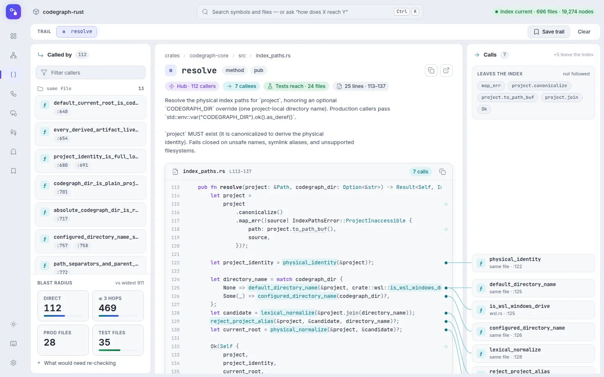
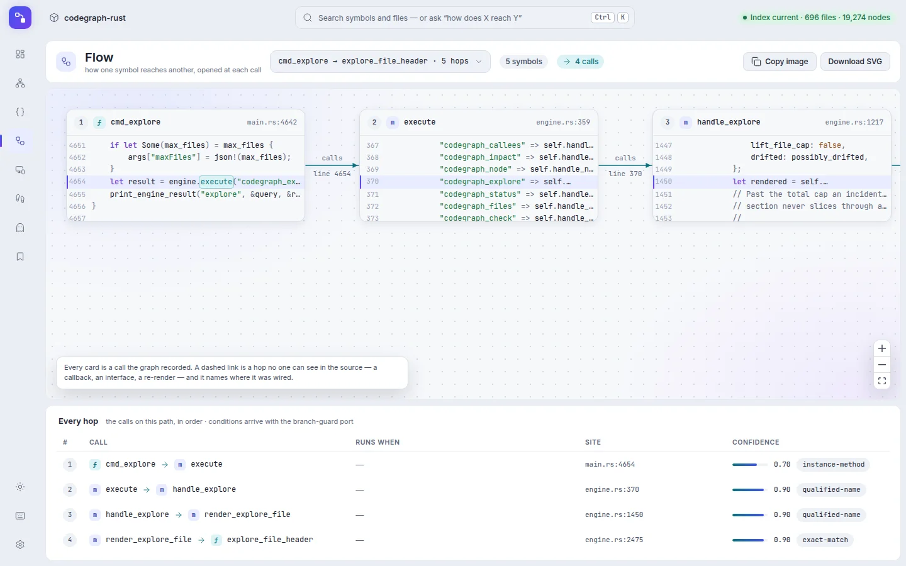
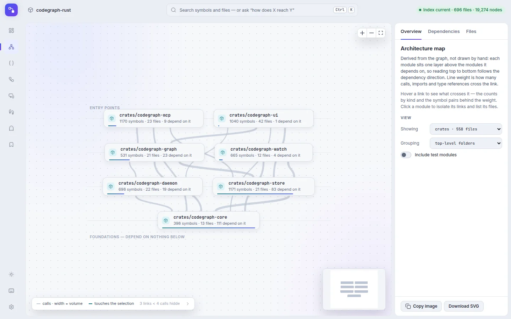

<div align="center">

# CodeGraph-Rust

**面向编码代理与开发者的确定性代码智能。**

一个原生二进制集成 tree-sitter 提取、SQLite/FTS5 检索、图遍历、CLI 与 MCP。
索引器内部不包含 AI 或向量运行时。

[](https://github.com/sunerpy/codegraph-rust/actions/workflows/ci.yml)
[](https://github.com/sunerpy/codegraph-rust/releases)
[](https://codecov.io/gh/sunerpy/codegraph-rust)
[](../../LICENSE-MIT)

[English](../../README.md) · [简体中文](README.zh-CN.md) ·
[网站](https://firlab.app/codegraph/) · [文档](../README.md) ·
[浏览器查看器](#浏览器查看器) · [交流与反馈](#交流与反馈) · [参与贡献](../../CONTRIBUTING.md)

<picture>
  <source media="(prefers-color-scheme: dark)" srcset="../site/public/screens/viewer-symbol-dark.webp" />
  
</picture>

</div>

## 为什么选择 CodeGraph

CodeGraph 把源码树转换成本地知识图谱：符号成为节点，调用、导入、继承、归属、
引用和类型关系成为边。图谱按项目持久化，查询时无需让 LLM 反复全文搜索来重建结构。

- **确定性：** 无模型调用、embedding 或向量检索；字节稳定 golden fixture 守护
  canonical 图谱输出。
- **源码感知：** search、callers/callees、impact、文件源码和多文件探索共享同一索引。
- **代理友好：** MCP 服务器暴露与 CLI 相同的图谱和逐字源码。
- **可视化（预览）：** 本地浏览器查看器读取同一份索引：并排显示一个符号的调用方、
  源码和被调用方，以及调用路径、架构图、类型层级和没有代码到达的符号。
- **本地优先：** 索引位于项目内；共享 daemon 和 HTTP transport 都是本地进程。
- **广泛语言覆盖：** grammar、嵌入式/模板文件以及 Godot、Tauri、JS 生态框架
  关系使用同一 schema。
- **增量更新：** `sync` 与 watcher 只处理变化文件，最终 canonical 结果与干净全量
  索引一致。

精确语言清单与静态分析边界见
[`docs/languages.md`](../languages.md)。

## 安装

### 带校验的 Release 安装器

安装器会选择当前平台归档，要求它出现在 `SHA256SUMS` 中，校验 checksum 后才安装。

```sh
# Linux / macOS
curl -fsSL https://raw.githubusercontent.com/sunerpy/codegraph-rust/main/scripts/install.sh | sh
```

```powershell
# Windows PowerShell 5.1+
irm https://raw.githubusercontent.com/sunerpy/codegraph-rust/main/scripts/install.ps1 | iex
```

需要可复现安装时固定精确 Release：

```sh
curl -fsSL https://raw.githubusercontent.com/sunerpy/codegraph-rust/vX.Y.Z/scripts/install.sh \
  | CODEGRAPH_VERSION=vX.Y.Z sh
```

```powershell
$env:CODEGRAPH_VERSION = "vX.Y.Z"
irm https://raw.githubusercontent.com/sunerpy/codegraph-rust/vX.Y.Z/scripts/install.ps1 | iex
```

### 预编译归档

GitHub Releases 发布以下归档系列：

| 平台                | Target                       | 归档      |
| ------------------- | ---------------------------- | --------- |
| Linux x86_64        | `x86_64-unknown-linux-musl`  | `.tar.gz` |
| Linux ARM64         | `aarch64-unknown-linux-musl` | `.tar.gz` |
| macOS Intel         | `x86_64-apple-darwin`        | `.tar.gz` |
| macOS Apple Silicon | `aarch64-apple-darwin`       | `.tar.gz` |
| Windows x86_64      | `x86_64-pc-windows-msvc`     | `.zip`    |
| Windows ARM64       | `aarch64-pc-windows-msvc`    | `.zip`    |

Linux 归档是静态链接的 musl 构建，内存分配走 mimalloc；macOS 与 Windows 归档使用系统分配器。

每个 Release 还包含 `SHA256SUMS`。GitHub CLI 用户可进一步验证归档构建来源：

```bash
gh attestation verify codegraph-X.Y.Z-x86_64-unknown-linux-musl.tar.gz \
  --repo sunerpy/codegraph-rust \
  --signer-workflow sunerpy/codegraph-rust/.github/workflows/release.yml \
  --deny-self-hosted-runners
```

### 从 Git 构建

本项目不发布到 crates.io：

```bash
cargo install --locked --git https://github.com/sunerpy/codegraph-rust codegraph-rs
```

安装后的命令名是 `codegraph`；SQLite 已内置。

## 快速上手

创建索引、检查状态，然后提出结构问题：

```bash
cd /path/to/project
codegraph init .
codegraph status . --json
codegraph search "main" -p .
codegraph explore "startup and configuration flow" -p .
```

生命周期命令使用位置项目路径；研究命令只接受一个 query/target，并通过
`-p/--path` 指定项目。例如：

```bash
codegraph sync .
codegraph node "ReferenceResolver" -p .
codegraph callers "ReferenceResolver" -p .
codegraph impact "ReferenceResolver" -p .
```

参数被拒绝时先运行 `codegraph <command> --help`；不要因为生命周期命令和研究命令
路径语法不同，就放弃已有索引。

## CLI

常用流程：

```bash
# 索引生命周期
codegraph status . --json
codegraph sync .
codegraph index .                 # 对选中项目完整重建

# 代码研究
codegraph search "symbol" -p .
codegraph explore "area or flow" -p .
codegraph node "symbol-or-id" -p .
codegraph files -p . --format tree

# 关系查询
codegraph callers "symbol" -p .
codegraph callees "symbol" -p .
codegraph impact "symbol" -p .

# 运行与观测
codegraph serve --mcp --path .
codegraph serve --http --path .
codegraph mcp list
codegraph http list
```

`query` 仍是 `search` 的兼容别名。所有命令和参数见
[`docs/cli.md`](../cli.md)。

## MCP

手工注册 stdio 服务器：

```jsonc
{
  "mcpServers": {
    "codegraph": {
      "command": "codegraph",
      "args": ["serve", "--mcp"],
    },
  },
}
```

也可由安装器修改支持的代理配置：

```bash
codegraph install --yes
codegraph install --yes --init
codegraph install --target=codex,claude,kiro --yes
```

不带 `--path` 启动的服务器可通过每次调用显式传入的 `projectPath`、客户端 roots，
或确定性的 workspace adoption 选择已有索引。首次显式访问已有索引时会先等待
catch-up，并保留该项目的共享 daemon/watcher；多个子项目仍使用各自独立索引，多个
MCP 会话则复用每个项目唯一的 writer。需要把某项目设为默认值时再固定 `--path`。
`CODEGRAPH_NO_DAEMON=1` 会显式关闭这种跨项目的懒加载 daemon 服务。

默认可见 MCP surface 聚焦 explore、文件/符号读取、search 与 callers；其他已知
工具可通过 `CODEGRAPH_MCP_TOOLS` 启用。工具 schema、项目解析、stdio/HTTP 行为与
协议兼容性见 [`docs/mcp.md`](../mcp.md)。

## Agents 与 IDE

`codegraph install` 支持常见编码代理和 IDE。部分客户端可在全局配置中展开 workspace
变量；另一些客户端要获得实时 watcher，就必须写入带绝对路径的项目级配置。安装器会
明确说明差异，不会猜测。

```bash
codegraph install --target=auto --global --yes
codegraph install --target=auto --local --yes
codegraph init --target=kiro .
codegraph init --target=zed .
```

可选的内嵌 Skill 会教代理优先用 CodeGraph，而不是先 grep/read：

```bash
codegraph skill install --yes
codegraph skill status
codegraph skill update --dry-run --diff
```

<details>
<summary>给编码代理的精简规则</summary>

1. 研究前运行 `codegraph status <project> --json`。
2. 架构、bug 或流程问题先调用 `codegraph_explore`。
3. 用 `codegraph_search` 定位名称；用 `codegraph_node` 读取一个符号或已索引文件，
   同时获取 callers/callees 轨迹。
4. 修改共享符号前调用 `codegraph_impact`。
5. 信任结构索引；只重新读取响应明确标记为 stale 的文件。
6. 普通追赶运行 `codegraph sync <project>`；只有 status 或请求动作明确要求时才重建。

</details>

完整目标和配置矩阵：[`docs/cli.md`](../cli.md)、
[`docs/mcp.md`](../mcp.md) 与
[`editors/zed/README.md`](../../editors/zed/README.md)。

## 浏览器查看器

`codegraph ui` 在浏览器中以只读方式打开项目的索引。它目前是预览功能，未设置
`CODEGRAPH_UI=1` 时会被拒绝：

```bash
CODEGRAPH_UI=1 codegraph ui              # 当前所在的已建立索引的项目
CODEGRAPH_UI=1 codegraph ui --read-only  # 同时拒绝保存 Trail
```

它只监听 `127.0.0.1`，从不建立或修改索引，唯一写入的是你主动保存在
`.codegraph/ui/trails/` 下的 Trail。它有深色和浅色两种主题，在你选择之前跟随系统设置。

<table>
  <tr>
    <td width="50%"><picture><source media="(prefers-color-scheme: dark)" srcset="../site/public/screens/viewer-flow-dark.webp" /></picture></td>
    <td width="50%"><picture><source media="(prefers-color-scheme: dark)" srcset="../site/public/screens/viewer-map-dark.webp" /></picture></td>
  </tr>
  <tr>
    <td>Flow：从一个函数到另一个函数的调用路径</td>
    <td>Map：模块及其依赖关系</td>
  </tr>
</table>

网站上有每个视图的介绍：[浏览器查看器](https://firlab.app/codegraph/guide/viewer)。参考文档见
[`docs/ui.md`](../ui.md)。

## 确定性与安全边界

兼容性契约包括稳定 node ID、canonical golden artifact、SQLite schema parity、
确定性解析与排序、项目范围内的文件系统访问，以及对歧义 fail-closed。增量输出会与
干净全量索引进行等价验证。

CodeGraph 报告静态证据，不承诺运行时确定性。反射、注册表、事件总线、框架约定、
生成代码和动态 dispatch 都可能在已知边之外继续。没有静态引用不等于代码一定无用。

Schema 与 oracle 细节见 [`docs/data-model.md`](../data-model.md) 和
[`docs/equivalence.md`](../equivalence.md)。安全问题请按
[`SECURITY.md`](../../SECURITY.md) 报告。

## 性能

性能由仓库内 benchmark harness 在固定 corpus 上测量。有效结果必须记录实现 commit、
环境、缓存策略、运行次数、中位数、离散度与查询百分位。本 README 不保留随版本漂移的
延迟数字。

方法与当前结果状态见 [`docs/benchmark.md`](../benchmark.md) 和
[`docs/benchmark-results.md`](../benchmark-results.md)。

## 开发

固定 Rust toolchain 和锁定依赖图都是仓库契约。开始方式：

```bash
git clone https://github.com/sunerpy/codegraph-rust.git
cd codegraph-rust
make hooks
make check
```

`make check` 与 `make ci` 执行同一条完整本地质量路径；`make pre-ci` 额外执行本地归档打包、解包与运行 smoke。聚焦目标可通过 `make help` 查看。贡献者应阅读 [`CONTRIBUTING.md`](../../CONTRIBUTING.md) 和
canonical agent 契约 [`AGENTS.md`](../../AGENTS.md)。

## 文档

- [firlab.app/codegraph](https://firlab.app/codegraph/) — 网站：指南、快速开始和查看器介绍
  （[English](https://firlab.app/codegraph/en/)）
- [`docs/README.md`](../README.md) — 文档地图
- [`docs/architecture.md`](../architecture.md) — workspace 与运行时设计
- [`docs/cli.md`](../cli.md) — 完整命令参考
- [`docs/mcp.md`](../mcp.md) — MCP transport、工具与客户端
- [`docs/ui.md`](../ui.md) — 本地浏览器查看器（预览，`CODEGRAPH_UI=1`）
- [`docs/languages.md`](../languages.md) — 语言覆盖与边界
- [`docs/equivalence.md`](../equivalence.md) — 确定性 golden 契约
- [`docs/upstream-sync/UPSTREAM.md`](../upstream-sync/UPSTREAM.md) — 上游台账
- [`docs/troubleshooting.md`](../troubleshooting.md) — 诊断流程

## 交流与反馈

- 提问、问题报告和功能建议：[GitHub Issues](https://github.com/sunerpy/codegraph-rust/issues)。
- 微信：公众号「六月水蓝」。


## 许可证

MIT，详见 [`LICENSE-MIT`](../../LICENSE-MIT)。
